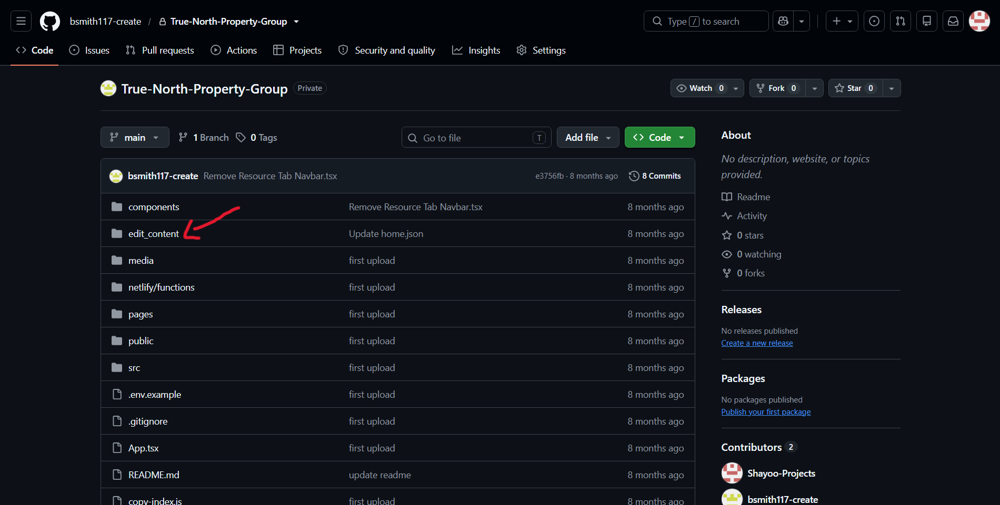
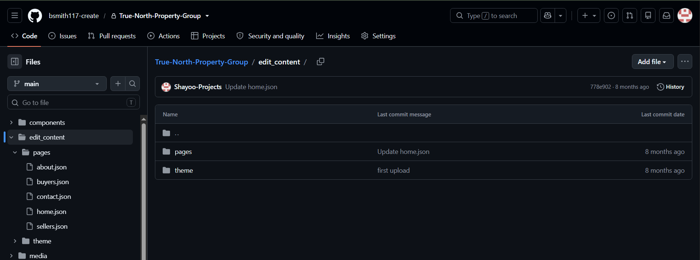
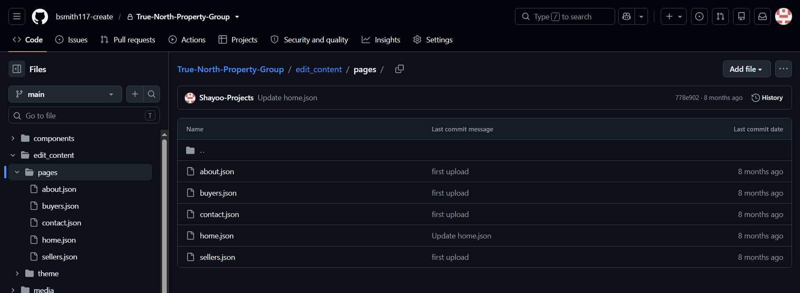
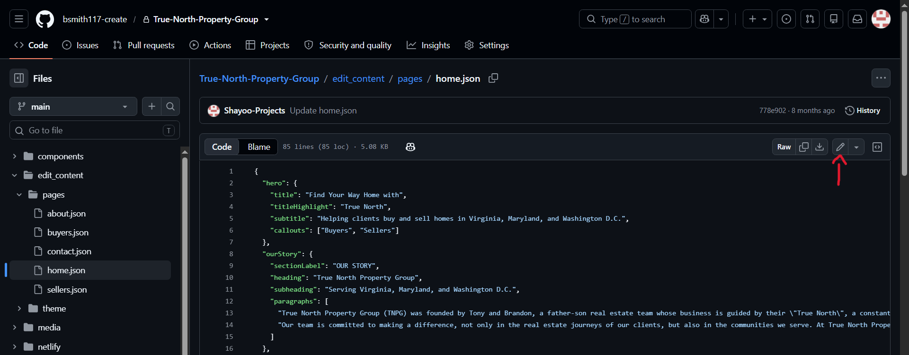
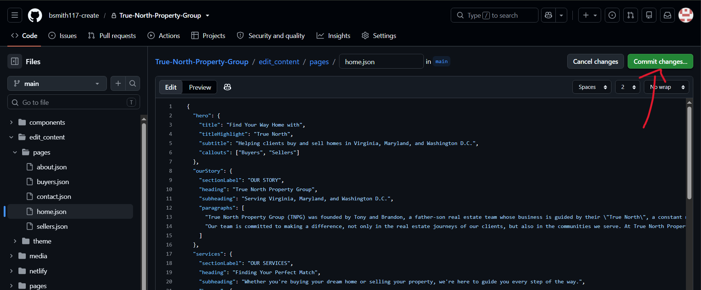
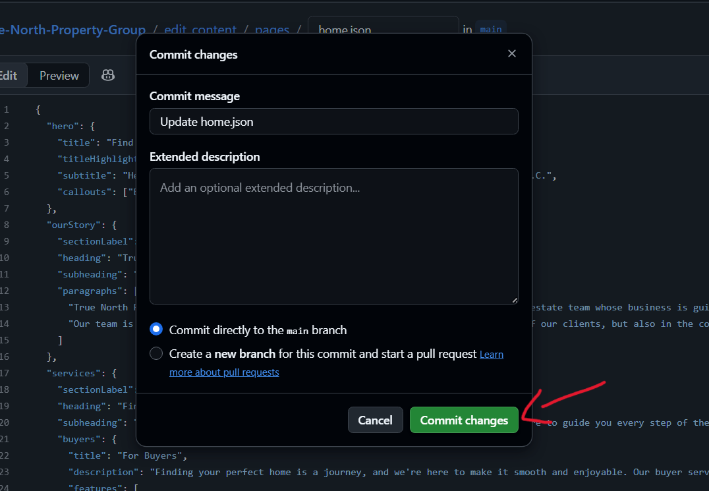

# True North Property Group Website


Marketing website for True North Property Group, built with Vite + React and deployed on Netlify.  
It highlights the firm's services across Virginia, Maryland, and Washington D.C., and provides a Netlify Function–backed contact form that emails inquiries via Resend.

## Table of Contents
1. [Features](#features)  
2. [Tech Stack](#tech-stack)  
3. [Project Structure](#project-structure)  
4. [Getting Started](#getting-started)  
5. [Environment Variables](#environment-variables)  
6. [Available Scripts](#available-scripts)  
7. [Content Editing](#content-editing)  
8. [Deployment](#deployment)  
9. [Netlify Functions](#netlify-functions)

## Features
- ⚡️ **Fast static site** powered by Vite and React 19.  
- 🧭 **Content-driven pages** sourced from YAML under `edit_content/`.  
- 🎨 **Theme from YAML** — brand colors and fonts are generated from `edit_content/theme/theme.yaml` at build time.  
- 📮 **Serverless contact form** handled by a Netlify Function using the Resend API.  
- 📱 **Responsive layout** tailored for desktop and mobile visitors.  
- 🛠 **TypeScript typings** across components and functions for safer development.

## Tech Stack
- React 19 + TypeScript
- Vite 8
- Tailwind CSS 4
- Netlify (builds, hosting, and serverless functions)
- Resend (email delivery for inquiries)

## Project Structure
```
├── src/                    # Core React source (routes, layouts, components)
├── components/             # Shared UI building blocks
├── pages/                  # Page-level React components
├── utils/                  # Shared utilities (currency, theme loader)
├── scripts/
│   └── generate-theme.mjs  # Build script: theme.yaml → src/theme.generated.css
├── edit_content/           # YAML content editors modify (no code needed)
│   ├── pages/              # Page content (home.yaml, about.yaml, buyers.yaml, ...)
│   └── theme/              # Brand theme (colors, fonts) — theme.yaml
├── netlify/
│   └── functions/          # Serverless functions (contact-form.ts)
├── media/                  # Site images imported by components (headers, profiles, photos)
├── dist/                   # Production build output
├── netlify.toml            # Build & dev configuration
└── package.json
```

## Getting Started
```bash
# 1. Install dependencies
npm install

# 2. Start the development server (http://localhost:3000)
npm run dev

# 3. Create a production build in dist/
npm run build
```

> **Note:** Both `npm run dev` and `npm run build` automatically run `scripts/generate-theme.mjs` first, which reads `edit_content/theme/theme.yaml` and produces `src/theme.generated.css`. This file is a build artifact and is not committed.

## Environment Variables
| Variable | Description |
| --- | --- |
| `RESEND_API_KEY` | API key for sending transactional emails via Resend. |
| `RESEND_FROM_EMAIL` | Sender address (e.g., `contact@tnpghomes.com`). |
| `RESEND_TO_EMAIL` | Recipient inbox for contact form submissions. |

Set these in Netlify (Site settings → Environment variables). Local development uses `.env`.

## Available Scripts
| Command | Description |
| --- | --- |
| `npm run dev` | Starts the Vite dev server with theme generation. |
| `npm run build` | Generates theme tokens, then produces the production build in `dist/`. |
| `npm run preview` | Serves the production build locally. |

## Content Editing


All website copy lives in YAML files under `edit_content/` — no coding required. This guide covers editing directly in the **GitHub web interface** (no local setup needed).

### Where the content lives

| File                                | What it controls                                                        |
| ----------------------------------- | ----------------------------------------------------------------------- |
| `edit_content/pages/home.yaml`      | Home page (hero, story, services, expertise, testimonials, contact CTA) |
| `edit_content/pages/about.yaml`     | About page (mission, team, why choose us, CTA)                          |
| `edit_content/pages/buyers.yaml`    | For Buyers page (about, journey, services, pricing)                     |
| `edit_content/pages/sellers.yaml`   | For Sellers page (about, journey, benefits, costs)                      |
| `edit_content/pages/contact.yaml`   | Contact page (heading, contact info)                                    |
| `edit_content/pages/resources.yaml` | Resources section in the site navigation and footer                     |
| `edit_content/theme/theme.yaml`     | Brand colors and fonts site-wide                                        |

### Editing a file in the GitHub web UI (step by step)

1. **Open the file you want to edit.** Go to https://github.com/ and log in. Navigate to the folder `edit_content`. There are 2 options — `pages` and `theme` — select the folder that needs changes and select the file you want to edit, e.g. `edit_content/pages/home.yaml`.

   

   

   

2. **Click the pencil icon** ("Edit this file") in the top-right corner of the file view.

   

3. **Make your change.** Only change the text inside the quotation marks — do not touch the key names, indentation, or structure. Example — change the hero title:

   **Before:**
   ```yaml
   hero:
     title: "Find Your Way Home with"
   ```

   **After:**
   ```yaml
   hero:
     title: "Find Your Dream Home with"
   ```

4. **Check for errors.** GitHub validates YAML as you type. If there is a syntax problem (broken indentation, missing quote, stray character), GitHub shows a red warning at the bottom of the editor. Fix it before committing — a malformed file will fail the build.

5. **Commit your change.** Scroll to the bottom of the page, enter a short description in the "Commit changes" box (e.g. "Update hero title"), and click the green **"Commit changes"** button. Keep the default option of committing directly to the main branch unless you are using a review workflow.

   

   

6. **Wait for the build.** After committing, GitHub triggers a Netlify build automatically. You can watch it on Netlify → Deploys. It typically takes 1–2 minutes.

7. **Verify the site.** Once the deploy shows "Published", reload your site (hard-refresh with `Ctrl+Shift+R` if you don't see the change — the browser may have cached the old page).

### Important rules when editing

- **Only change the text values.** Key names (`title:`, `description:`, `quote:`…) are read by the components — renaming or removing one breaks the page.
- **Keep the structure and indentation identical.** YAML uses indentation to nest content. Do not change spacing, dashes (`-`), or the number of list items unless you are also updating the component that renders them.
- **Keep quotes balanced.** Text values are wrapped in `"..."` — make sure your edit keeps both quotes.
- **Do not add trailing commas.** Those are valid in JSON but invalid in YAML.
- **Theme colors/fonts** are edited in `edit_content/theme/theme.yaml`, not in the page files.

### Update YAML with AI

- Use ChatGPT or any AI provider of your choice to edit the YAML if needed
- Provide the YAML file with the information you want to change with the prompt below:

#### Prompt:
Update this YAML file for a website content system. It must remain valid YAML and keep the same structure the app expects. Fix any formatting issues, preserve all keys and nesting, and keep the content semantically the same. Do not change the app code or the schema. Do not rename fields, do not remove sections, and do not add unsupported data. Use correct YAML indentation and valid quoting. Return the corrected YAML content only, or the corrected YAML plus a brief explanation of what was fixed.

### Save changes to update the website

```
Edit YAML on GitHub → Commit changes → Netlify automatically rebuilds → Site updates (~1–2 min)
```

## Deployment

- This site is deployed automatically on **Netlify** from the GitHub repository when you save the changes. 
- Configuration lives in `netlify.toml`. Deploys are triggered automatically on every push to the repository, there is nothing to run manually.

## Netlify Functions

`netlify/functions/contact-form.ts` powers the Contact page form:

- Accepts `POST` requests only.
- Validates that required fields (`firstName`, `lastName`, `email`, `message`) are present.
- Sends the inquiry via the **Resend** API using the `RESEND_API_KEY`, `RESEND_FROM_EMAIL`, and `RESEND_TO_EMAIL` environment variables.
- Returns a success message with the email ID, or a descriptive error.

No database is used, submissions arrive as emails in the recipient inbox.